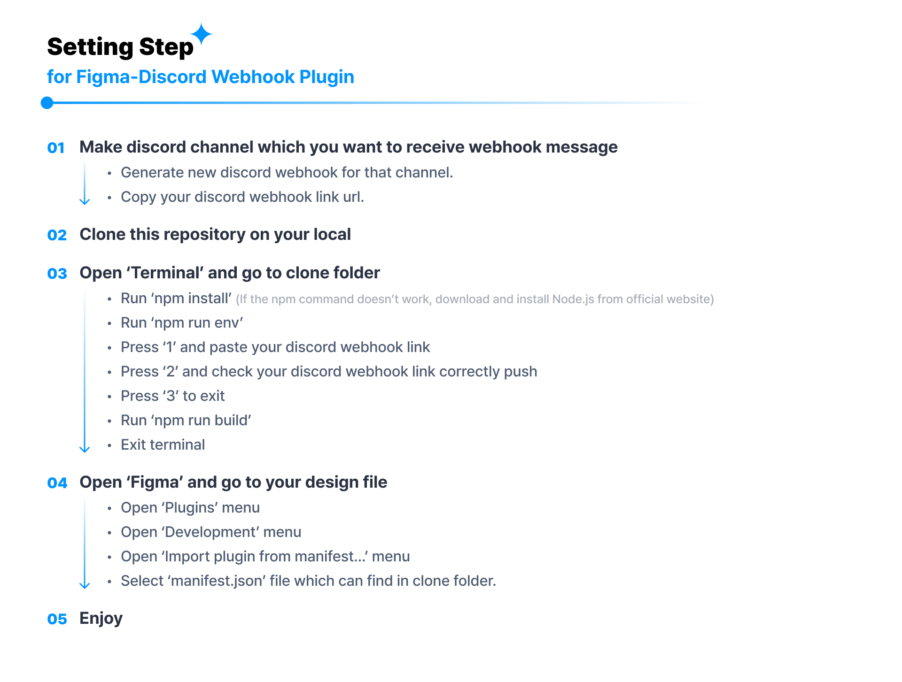

## Notice

This repository is based on Bryanberger's figma-discord-upload-webhook for improved functionality and convenience.

Existing repositories include.
https://github.com/bryanberger/figma-discord-upload-webhook

## How to use

## License

This project is licensed under the MIT License - see the [LICENSE](LICENSE) file for details.
